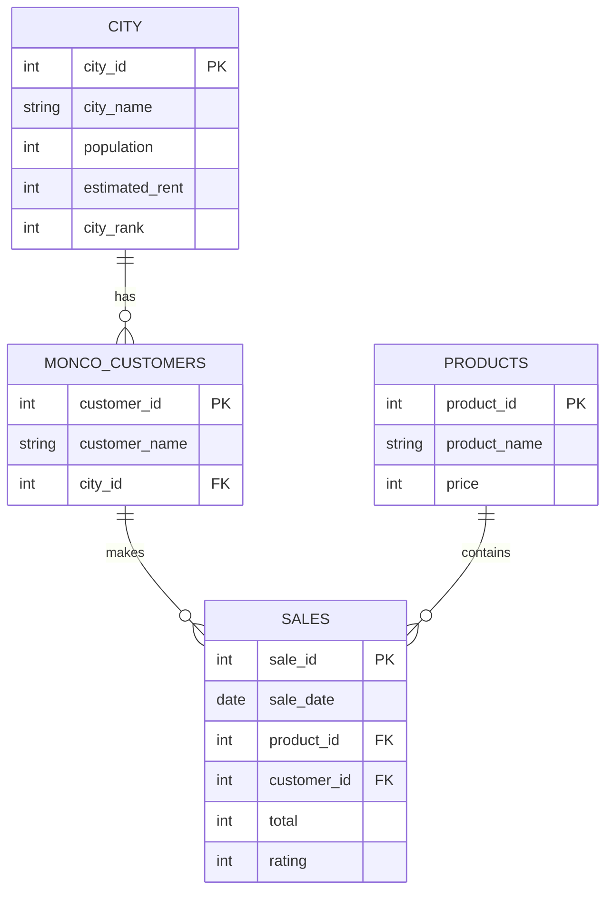

# ☕ Monday Coffee — SQL Sales Analysis

A portfolio SQL project analysing coffee retail sales, customer activity, product performance, city-level spending, monthly sales trends, and market potential using a relational dataset.

## 📌 Project Overview

The **Monday Coffee Analysis** project uses SQL to turn raw city, customer, product, and sales data into business-focused reports.

The analysis answers 10 practical questions, including:

* Estimated coffee consumers by city
* Total revenue generated in Q4 2023
* Sales frequency by product
* Average sales per customer by city
* Top-selling products in each city
* Unique customers purchasing coffee-related products
* Average sales compared with estimated city rent
* Month-over-month sales growth
* Top cities by sales and estimated market potential

The project also begins with basic dataset validation to check for missing values, duplicate sale IDs, invalid customer references, and null sale dates.

---

## 🗂️ Dataset

The project contains four CSV files:

| File                  |   Rows | Columns | Purpose                                                             |
| --------------------- | -----: | ------: | ------------------------------------------------------------------- |
| `city.csv`            |     14 |       5 | City population, estimated rent, and city rank                      |
| `monco_customers.csv` |    497 |       3 | Customer details and city mapping                                   |
| `products.csv`        |     28 |       3 | Product catalogue and prices                                        |
| `sales.csv`           | 10,388 |       6 | Sales transactions, dates, products, customers, totals, and ratings |

### Sales Period

The sales data covers **1 January 2023 to 1 October 2024**.

### Main Columns

**city**

* `city_id`
* `city_name`
* `population`
* `estimated_rent`
* `city_rank`

**monco_customers**

* `customer_id`
* `customer_name`
* `city_id`

**products**

* `product_id`
* `product_name`
* `price`

**sales**

* `sale_id`
* `sale_date`
* `product_id`
* `customer_id`
* `total`
* `rating`

---

## 🔗 Data Relationships



---

## 🧹 Data Validation

The SQL script includes checks for:

1. **Missing values** — checks for null city names.
2. **Duplicate records** — checks for repeated `sale_id` values.
3. **Invalid foreign keys** — checks whether every sales customer exists in the customer table.
4. **Invalid dates** — checks for null `sale_date` values.

A broader validation of the supplied CSV files found:

* No missing values across the four datasets
* No duplicate primary IDs
* No invalid `customer_id` references in `sales`
* No invalid `product_id` references in `sales`
* No invalid `city_id` references in `monco_customers`
* No null sales dates

---

## 📊 Business Questions & SQL Analysis

### 1. Coffee Consumers Count

Estimates the number of coffee consumers in each city using the assumption that **25% of the population consumes coffee**.

**SQL concepts:** `SELECT`, arithmetic calculation, `ROUND()`

### 2. Total Revenue from Coffee Sales

Calculates total sales revenue for **October, November, and December 2023**.

**SQL concepts:** `SUM()`, `YEAR()`, `MONTH()`, `WHERE`

### 3. Sales Count for Each Product

Counts how many sales records exist for each product.

**SQL concepts:** `JOIN`, `COUNT()`, `GROUP BY`

### 4. Average Sales Amount per City

Calculates total spending per customer first, then finds the average customer spending for each city.

**SQL concepts:** `CTE`, `SUM()`, `AVG()`, multiple `JOIN`s, `GROUP BY`

### 5. City Population and Coffee Consumers

Combines each city's population with the estimated number of coffee consumers.

**SQL concepts:** calculated columns, `ROUND()`

### 6. Top Selling Products by City

Finds the top three products within each city using a window function.

**SQL concepts:** subqueries, `SUM()`, `RANK() OVER()`, `PARTITION BY`

### 7. Customer Segmentation by City

Counts unique customers in each city who purchased products whose names contain **"Coffee"**.

**SQL concepts:** `COUNT(DISTINCT ...)`, `LIKE`, `JOIN`, `GROUP BY`

### 8. Average Sale vs Rent

Compares average customer sales with the city's estimated rent.

**SQL concepts:** subquery, `SUM()`, `AVG()`, `ROUND()`, `GROUP BY`

### 9. Monthly Sales Growth

Calculates month-over-month sales growth using the previous month's sales as the comparison point.

**SQL concepts:** `CTE`, `DATE_FORMAT()`, `LAG()`, percentage calculation, window functions

### 10. Market Potential Analysis

Identifies the three cities with the highest total sales and returns:

* City name
* Total sales
* Estimated rent
* Number of customers
* Estimated coffee consumers

**SQL concepts:** multiple `JOIN`s, aggregate functions, `COUNT(DISTINCT ...)`, `ORDER BY`, `LIMIT`

---

## 💡 Key Findings

### Q4 2023 Revenue

Total sales revenue for the last quarter of 2023 was:

**1,963,300**

### Top Cities by Total Sales

| City      | Total Sales | Customers | Estimated Coffee Consumers |
| --------- | ----------: | --------: | -------------------------: |
| Pune      |   1,258,290 |        52 |                  1,875,000 |
| Chennai   |     944,120 |        42 |                  2,775,000 |
| Bangalore |     860,110 |        39 |                  3,075,000 |

### Highest Average Sales per Customer

The city-level averages calculated by the project were:

| City      | Average Sales per Customer |
| --------- | -------------------------: |
| Pune      |                  24,197.88 |
| Chennai   |                  22,479.05 |
| Bangalore |                  22,054.10 |

### Highest Monthly Sales

The highest monthly sales total in the dataset occurred in **November 2023**, at:

**709,200**

### Monthly Growth

The largest month-over-month increase was recorded in **September 2023**, at:

**169.54%**

The largest decline was recorded in **October 2024**, at:

**-96.79%**

October 2024 contains only **8 sales records**, so that final-month decline should be interpreted cautiously rather than treated as a normal full-month trend.

### Leading Product by Sales Frequency

`Cold Brew Coffee Pack (6 Bottles)` had the highest number of sales records:

**1,326 sales records**

---

## 🛠️ SQL Techniques Used

This project demonstrates practical MySQL skills including:

* `SELECT` and `WHERE`
* `JOIN`
* `LEFT JOIN`
* `GROUP BY` and `HAVING`
* `COUNT()` and `COUNT(DISTINCT ...)`
* `SUM()` and `AVG()`
* `ROUND()`
* `LIKE`
* `YEAR()` and `MONTH()`
* `DATE_FORMAT()`
* Common Table Expressions (`WITH`)
* Subqueries
* Window functions
* `RANK() OVER()`
* `LAG() OVER()`
* `ORDER BY`
* `LIMIT`

---

## 📈 Business Value

The analysis can support business questions such as:

* Where is sales activity strongest?
* Which products generate the most sales activity?
* How much are customers spending on average in each city?
* How does sales performance compare with estimated rent?
* How are sales changing month by month?
* Which cities show the strongest sales performance alongside population-based coffee demand?

The project demonstrates how SQL can move from **data validation → analysis → business insights** in one workflow.

---

## ⚠️ Interpretation Notes

A few field names in the original SQL should be understood according to how the queries are actually written:

* **"Estimated coffee consumers"** is an estimate equal to 25% of city population; it is not a measured customer count.
* In Query 3, **`quantity_sold` is calculated with `COUNT(*)`** because the sales table does not contain a separate quantity column.
* In Query 6, **`sales_volume` is calculated with `SUM(total)`**, so it represents sales value rather than unit volume.
* In Query 7, customers are counted for products whose `product_name` contains the word **"Coffee"**.
* In Query 8, `estimated_rent` is a city-level value from the city table, so the result is a comparison with the city's estimated rent rather than an independently recorded rent paid by each customer.
* In Query 10, `total_rent` is obtained using `MAX(estimated_rent)` for each city, which returns the city's stored estimated rent value rather than a sum across customers or transactions.
* Monetary figures are reported in the numeric units provided by the dataset; the source files do not explicitly specify a currency.

---

## ▶️ How to Run

### 1. Create or select the database

The SQL script uses:

```sql
USE Projects;
```

Make sure a database named `Projects` exists.

### 2. Load the CSV files into tables

Create/import the four tables using these exact table names:

```text
city
monco_customers
products
sales
```

Make sure the table columns match the CSV structure listed above.

### 3. Run the SQL script

Open:

```text
Project 7 - Monday Coffee(1).sql
```

in MySQL Workbench, MySQL CLI, or another compatible MySQL environment and execute the queries.

---

## 📁 Project Structure

```text
Monday-Coffee-SQL-Analysis/
│
├── Project 7 - Monday Coffee(1).sql
├── city.csv
├── monco_customers.csv
├── products.csv
├── sales.csv
└── README.md
```

---

## 🎯 Skills Demonstrated

**SQL | MySQL | Data Cleaning & Validation | Data Analysis | Business Analysis | Aggregation | Joins | CTEs | Window Functions | Trend Analysis | Customer Analysis | Product Analysis**

---

## 👤 Project

**Monday Coffee — SQL Project 7**

Built as a practical SQL data analysis project focused on extracting business insights from relational sales data.
